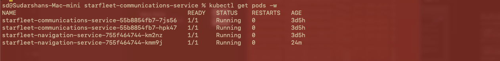
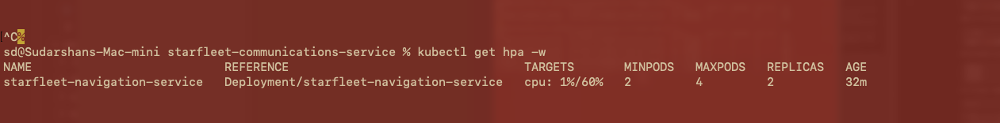
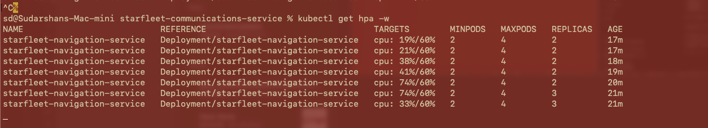
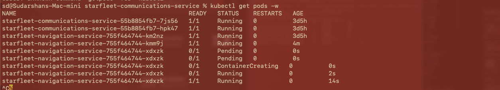

# Horizontal Pod Autoscaling (HPA) Validation

## Starfleet Navigation Service

This document records the Horizontal Pod Autoscaler validation performed for `starfleet-navigation-service` on GKE. The objective was to demonstrate that Kubernetes can automatically increase the number of application replicas when CPU utilization exceeds the configured target and return the workload to its minimum replica count after load is removed.

## HPA Configuration

The Navigation service uses the `autoscaling/v2` HorizontalPodAutoscaler with the following policy:

```yaml
apiVersion: autoscaling/v2
kind: HorizontalPodAutoscaler
metadata:
  name: starfleet-navigation-service
spec:
  scaleTargetRef:
    apiVersion: apps/v1
    kind: Deployment
    name: starfleet-navigation-service
  minReplicas: 2
  maxReplicas: 4
  metrics:
    - type: Resource
      resource:
        name: cpu
        target:
          type: Utilization
          averageUtilization: 60
```

The test criteria were:

- Minimum replicas: **2**
- Maximum replicas: **4**
- CPU utilization target: **60%**
- Scaling metric: **CPU utilization relative to the pod CPU request**

## 1. Baseline Pod State

Before generating load, the Navigation service was running with two healthy replicas. The Communications service was also running with two replicas. All pods were in the `Running` state with zero restarts.



**Figure 1 — Baseline pod state before the HPA load test.**

## 2. HPA Baseline

The HPA was checked before generating application traffic:

```bash
kubectl get hpa -w
```

CPU utilization was approximately **1%**, well below the configured **60%** target. The deployment therefore remained at the configured minimum of **2 replicas**.



**Figure 2 — HPA baseline showing 1% CPU utilization, a 60% target, minimum 2 replicas, maximum 4 replicas, and 2 active replicas.**

## 3. Load Generation and Scale-Up

HTTP traffic was generated against the public Navigation service endpoint while the HPA and pods were monitored.

The HPA utilization progressed through the following observed values:

| Observed CPU | HPA Target | Replicas |
| ---: | ---: | ---: |
| 19% | 60% | 2 |
| 21% | 60% | 2 |
| 38% | 60% | 2 |
| 41% | 60% | 2 |
| 74% | 60% | 2 |
| 74% | 60% | **3** |
| 33% | 60% | 3 |

Once CPU utilization reached **74%**, exceeding the **60%** target, Kubernetes automatically increased the Navigation deployment from **2 to 3 replicas**.



**Figure 3 — CPU utilization increases under load and the HPA automatically changes the replica count from 2 to 3.**

The pod watch independently confirmed that Kubernetes created the additional Navigation pod. The new pod progressed through `Pending`, `ContainerCreating`, and finally `Running` without manual scaling.



**Figure 4 — Third Navigation pod automatically created by the HPA during the scale-out event.**

After the third replica became available, observed average CPU utilization decreased from **74% to 33%**, showing that the additional capacity helped distribute the workload.

## 4. Automatic Scale-Down

After the load-generation process was stopped, CPU utilization fell back to approximately **1%**. Kubernetes subsequently returned the Navigation deployment to the configured minimum of **2 replicas**.


**Figure 5 — HPA after load removal, showing CPU at 1% and the deployment returned to 2 replicas.**

The workload was allowed to scale down automatically rather than using `kubectl scale`, ensuring that the test validated HPA behavior rather than manual intervention.

## Validation Result

**HPA validation: PASS**

The test demonstrated the complete autoscaling lifecycle:

```text
Normal traffic
    |
    v
2 replicas / CPU below 60%
    |
    v
Application load increased
    |
    v
CPU reached 74% (target = 60%)
    |
    v
HPA increased replicas: 2 -> 3
    |
    v
Additional pod became Running
    |
    v
CPU utilization decreased
    |
    v
Load stopped
    |
    v
CPU returned to approximately 1%
    |
    v
HPA returned replicas: 3 -> 2
```

This validates that the GKE metrics pipeline, Kubernetes resource metrics, HPA configuration, pod scheduling, automatic scale-out, and automatic scale-down are functioning for the Starfleet Navigation service.

## Useful Validation Commands

```bash
# Check HPA status
kubectl get hpa

# Continuously watch HPA changes
kubectl get hpa -w

# Watch pod creation/deletion
kubectl get pods -w

# Inspect HPA conditions and events
kubectl describe hpa starfleet-navigation-service

# Check pod CPU and memory consumption
kubectl top pods

# Check node CPU and memory consumption
kubectl top nodes
```
